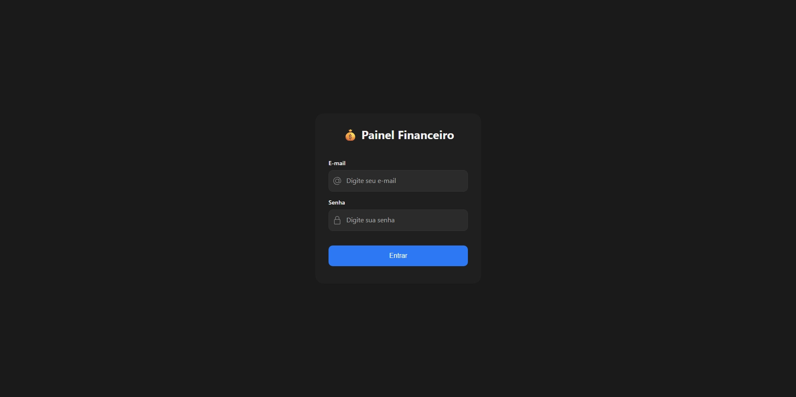
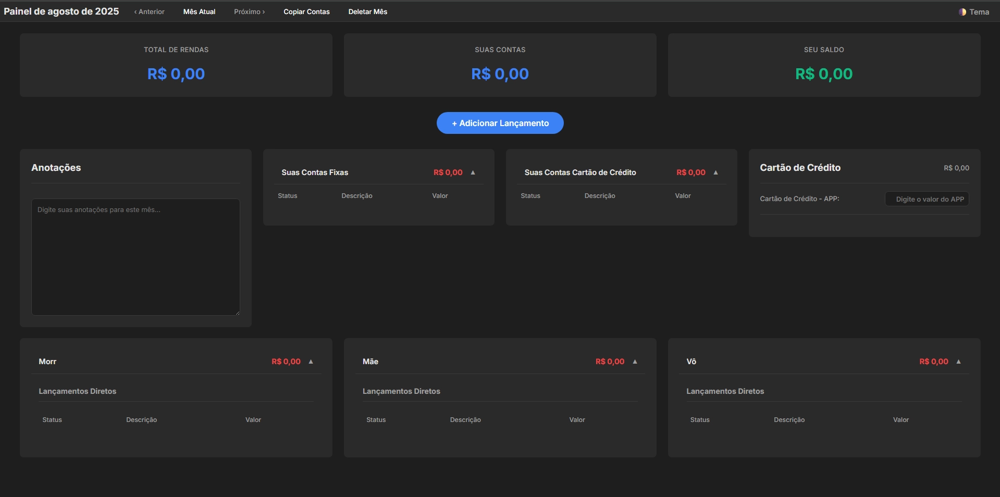

# 💰 Painel Financeiro


---

## 📋 Descrição

Um painel de controle financeiro pessoal, desenvolvido com foco em simplicidade, performance e segurança.  
Permite o gerenciamento de contas a pagar, rendas e anotações mensais, com uma interface limpa, responsiva e com tema claro/escuro.

---

## 📸 Screenshots


- **Tela de Login:**

  

- **Painel Principal:**

  

---

## ✨ Funcionalidades Principais

- 🔐 **Autenticação Segura** com `password_hash` / `password_verify`
- 📋 **CRUD Completo** de Contas e Rendas
- 🏷️ **Categorização de Lançamentos**: fixos, únicos, parcelados e por pessoa
- ✅ **Status de Pagamento**: marcar como pago/pendente com um clique
- 🧩 **Reordenação de Lançamentos** intuitiva
- 📆 **Gestão Mensal** com navegação entre meses e cópia de dados
- 📝 **Anotações Mensais** com salvamento automático
- 📌 **Valores de Conferência** para comparação com faturas externas
- 🌗 **Tema Claro e Escuro** com persistência da preferência
- 📱 **Design Responsivo** para desktop e mobile

---

## 🚀 Tecnologias Utilizadas

### Backend

- **PHP 8.1+**
- **PDO** (para acesso seguro ao banco)
- **API RESTful** para operações

### Frontend

- **JavaScript (Vanilla, ES6+)**
- **HTML5 + CSS3**
- **Variáveis CSS** para o sistema de temas

### Banco de Dados

- **MySQL 8.0+**

---

## 📂 Estrutura do Projeto

```text
/
├── api/
│   ├── anotacoes/
│   ├── auth/
│   ├── contas/
│   ├── lancamentos/
│   ├── rendas/
│   └── valores_conferencia/
├── assets/
│   ├── css/
│   ├── img/
│   └── js/
├── inc/
│   ├── conexao.php
│   ├── proteger_pagina.php
│   └── versao.php
├── index.php
├── login.php
├── gerar_hash.php
└── schema.sql
```

---

## 🛠️ Guia de Instalação

### Pré-requisitos

- Servidor web local (Apache, Nginx, etc.)
- PHP 8.1 ou superior
- MySQL 8.0 ou superior

### Passo 1: Clonar o Repositório

```bash
git clone https://github.com/dougllassillva27/contas-a-pagar.git
cd contas-a-pagar
```

### Passo 2: Configurar o Banco de Dados

1. Crie um novo banco no MySQL.
2. Importe o arquivo `schema.sql`.

### Passo 3: Criar o arquivo `.env`

O caminho do `.env` é definido em `inc/conexao.php`.  
Exemplo de conteúdo:

```ini
DB_HOST="localhost"
DB_PORT="3306"
DB_NAME="seu_banco_de_dados"
DB_USER="seu_usuario"
DB_PASS="sua_senha"
```

### Passo 4: Criar Usuário Inicial

1. Abra `gerar_hash.php`, defina uma senha e acesse via navegador.
2. Copie o hash gerado.
3. Execute no banco:

```sql
INSERT INTO usuarios (nome, email, senha_hash)
VALUES ('Seu Nome', 'seu_email@provedor.com', 'SEU_HASH_GERADO_AQUI');
```

### Passo 5: Acesse a Aplicação

Acesse via navegador:  
`http://localhost/contas/`

---

## 🔗 Endpoints da API

| Método | Endpoint                         | Descrição                                |
| ------ | -------------------------------- | ---------------------------------------- |
| GET    | `/api/contas/listar.php`         | Lista todas as contas do mês.            |
| GET    | `/api/rendas/listar.php`         | Lista todas as rendas do mês.            |
| GET    | `/api/anotacoes/obter.php`       | Obtém a anotação do mês.                 |
| POST   | `/api/contas/criar.php`          | Cria uma nova conta.                     |
| POST   | `/api/rendas/criar.php`          | Cria uma nova renda.                     |
| POST   | `/api/contas/atualizar.php`      | Atualiza uma conta existente.            |
| POST   | `/api/rendas/atualizar.php`      | Atualiza uma renda existente.            |
| POST   | `/api/contas/excluir.php`        | Exclui uma conta.                        |
| POST   | `/api/rendas/excluir.php`        | Exclui uma renda.                        |
| POST   | `/api/lancamentos/reordenar.php` | Reordena um lançamento.                  |
| POST   | `/api/anotacoes/salvar.php`      | Salva ou atualiza a anotação do mês.     |
| POST   | `/api/deletar_mes.php`           | Deleta todos os dados do mês.            |
| POST   | `/api/contas/copiar_mes.php`     | Copia os dados de um mês para o próximo. |

---

## 📬 Contribuições

Sinta-se à vontade para abrir Issues ou Pull Requests com melhorias ou correções.  
Se este projeto te ajudou, ⭐ deixe uma estrela no repositório!

---

## 📄 Licença

Distribuído sob a licença MIT. Consulte `LICENSE` para mais detalhes.
